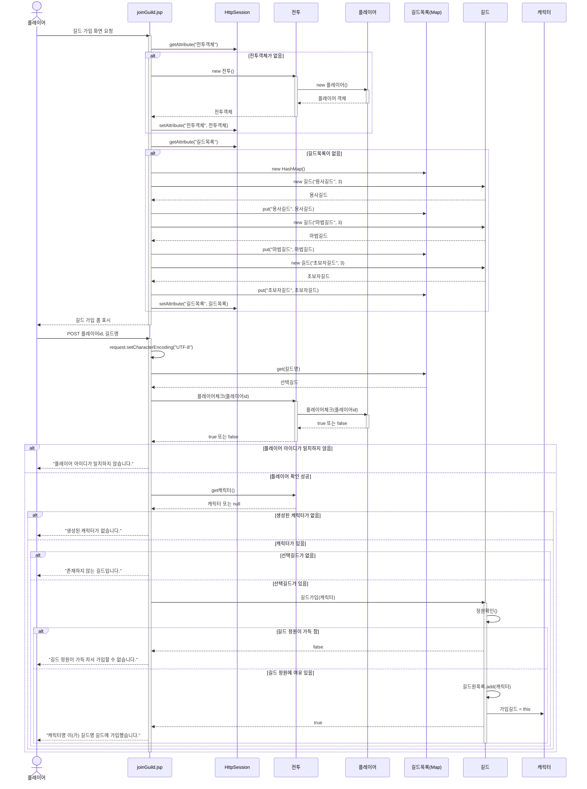

# 길드 가입 시퀀스 다이어그램

이 문서는 `src/main/webapp/joinGuild.jsp`, `src/main/java/game/전투.java`, `src/main/java/game/길드.java` 기준의 길드 가입 흐름을 정리합니다.

```mermaid
sequenceDiagram
    actor User as 플레이어
    participant JSP as joinGuild.jsp
    participant Session as HttpSession
    participant Battle as 전투
    participant Player as 플레이어
    participant GuildMap as 길드목록(Map)
    participant Guild as 길드
    participant Character as 캐릭터

    User->>JSP: 길드 가입 화면 요청
    activate JSP
    JSP->>Session: getAttribute("전투객체")
    alt 전투객체가 없음
        JSP->>Battle: new 전투()
        activate Battle
        Battle->>Player: new 플레이어()
        activate Player
        Player-->>Battle: 플레이어 객체
        deactivate Player
        Battle-->>JSP: 전투객체
        deactivate Battle
        JSP->>Session: setAttribute("전투객체", 전투객체)
    end

    JSP->>Session: getAttribute("길드목록")
    alt 길드목록이 없음
        JSP->>GuildMap: new HashMap()
        JSP->>Guild: new 길드("용사길드", 3)
        Guild-->>JSP: 용사길드
        JSP->>GuildMap: put("용사길드", 용사길드)
        JSP->>Guild: new 길드("마법길드", 3)
        Guild-->>JSP: 마법길드
        JSP->>GuildMap: put("마법길드", 마법길드)
        JSP->>Guild: new 길드("초보자길드", 3)
        Guild-->>JSP: 초보자길드
        JSP->>GuildMap: put("초보자길드", 초보자길드)
        JSP->>Session: setAttribute("길드목록", 길드목록)
    end

    JSP-->>User: 길드 가입 폼 표시
    deactivate JSP

    User->>JSP: POST 플레이어id, 길드명
    activate JSP
    JSP->>JSP: request.setCharacterEncoding("UTF-8")
    JSP->>GuildMap: get(길드명)
    GuildMap-->>JSP: 선택길드

    JSP->>Battle: 플레이어체크(플레이어id)
    activate Battle
    Battle->>Player: 플레이어체크(플레이어id)
    activate Player
    Player-->>Battle: true 또는 false
    deactivate Player
    Battle-->>JSP: true 또는 false
    deactivate Battle

    alt 플레이어 아이디가 일치하지 않음
        JSP-->>User: "플레이어 아이디가 일치하지 않습니다."
    else 플레이어 확인 성공
        JSP->>Battle: get캐릭터()
        Battle-->>JSP: 캐릭터 또는 null

        alt 생성된 캐릭터가 없음
            JSP-->>User: "생성된 캐릭터가 없습니다."
        else 캐릭터가 있음
            alt 선택길드가 없음
                JSP-->>User: "존재하지 않는 길드입니다."
            else 선택길드가 있음
                JSP->>Guild: 길드가입(캐릭터)
                activate Guild
                Guild->>Guild: 정원확인()

                alt 길드 정원이 가득 참
                    Guild-->>JSP: false
                    JSP-->>User: "길드 정원이 가득 차서 가입할 수 없습니다."
                else 길드 정원에 여유 있음
                    Guild->>Guild: 길드원목록.add(캐릭터)
                    Guild->>Character: 가입길드 = this
                    Guild-->>JSP: true
                    JSP-->>User: "캐릭터명 이(가) 길드명 길드에 가입했습니다."
                end
                deactivate Guild
            end
        end
    end

    deactivate JSP
```
